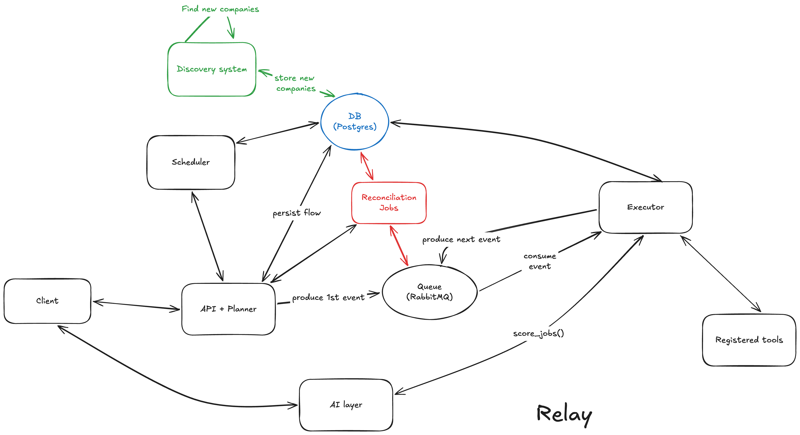

# Relay

A distributed runtime for persistent, scheduled AI workers. Go, PostgreSQL, RabbitMQ.

The interesting part of this repo isn't that it uses an LLM, it's where it stopped using one as its core layer.
Relay began as a general agent runtime: you give it a natural-language goal, an LLM reads a tool
registry (web search, Notion, Gmail etc) and plans the steps during run-time, and the steps are individually executed asynchronously. While building that system, 
I realized that the design is not going to work because a general agent for any task meant that you had flexibility, but it also meant
that your system was average at doing a lot of things. Not a lot of people are going to use that.

So I tore it out
([`48579d2`](../../commit/48579d2)) and rebuilt the same product on a deterministic pipeline. My
day job was payment systems, and Relay is what happens when you treat an LLM the way you treat an
unreliable network call: assume it occasionally returns garbage, and stay correct anyway.

I wanted to start by solving one problem in a consistently good way, and what better to solve as a student than to build a **job hunter**. 
You create a worker with your profile and a schedule, and
it polls curated company job boards, filters and ranks new roles against you, and remembers what
it has already shown you. Deduplication is important. You can create many different workers with their own schedules, for example - one for full-stack,
one for backend, one just for Golang, one just for New York etc. and you will get your results.

## The core decision: take the AI out of the control path

The original design let the LLM plan control flow - which tools, in what order, with what inputs.
It failed in boring ways: it picked the wrong tool, emitted step inputs referencing outputs that
didn't exist (crashing execution), and produced a different plan every time for the same request,
so nothing was reproducible or testable. Jack of all trades, master of none.

So the LLM came out of the control path. A job hunt is now a fixed `job_search → score_jobs`
pipeline built in code, and the model is confined to the two things code is genuinely worse at:
turning a resume into a structured profile, and judging how well a posting fits that profile. A
whole class of failures disappeared, and what remained became testable, which mattered more,
because the real work turned out to be data quality, not orchestration.

> **The rule: the LLM makes judgments, never control-flow decisions.**

## The model

- **Worker** — a standing job search you configure once: your profile plus filters
  (category, keywords, level, location) and a schedule. You can run as many as you want in parallel -
  one for backend, one for Go, one for New York, each with its own schedule and its
  own dedup history.
- **Run** — one execution of a worker, fired on its schedule or manually. A worker
  produces a stream of runs over its lifetime.
- **Step** — a run is an ordered list of steps (`job_search → score_jobs`). Each step
  is a durable row that the worker pool claims and executes independently and
  asynchronously - one step at a time, and a crash mid-run resumes from the last
  completed step rather than restarting.

## Architecture

Two processes over a queue. `cmd/api` owns state, scheduling, and three background crons
(scheduler, reconciler, discovery), `cmd/executor` is a pool of workers which well... they do the work. A run is a row
plus ordered step rows - each executor claims one step, runs one tool, persists the output, and
publishes the next, so no single process holds the workflow in memory.



### End to end

1. **Create a worker** - The client uploads a resume; the Planner extracts the text and asks the
   **AI layer** for a structured profile (category, keywords, experience level, years), which
   pre-fills the create form for the user to review. The worker is persisted with its schedule.
2. **A run starts** - the user clicks *Run now*, or the **Scheduler** fires a worker whose next
   run is due (it reads due workers from the DB and calls the Planner). The Planner writes two
   steps, `job_search → score_jobs`, and publishes the first event to RabbitMQ.
3. **`job_search`** - an executor consumes the event, claims the step, fetches every company
   board (Greenhouse, Lever, Ashby), filters by category / experience level / location, drops
   jobs this worker has already seen, persists the result, and publishes the next event.
4. **`score_jobs`** - another executor scores the survivors via the **AI layer** against the
   profile, blends fit with a recency score, re-applies the level gate against what the model
   reported, records the winners as seen, and marks the run complete. The client polls and
   renders the ranked roles.
5. **Underneath, always running** - the **Reconciliation** cron re-publishes steps stranded by a
   crashed worker; the **Discovery** cron independently grows the company catalog from public
   sources (a domain search API and the YC directory), verifies each board, and stores new
   companies.

## Correctness (where my payments background shows up a little)

- **Exactly-once step execution.** RabbitMQ is at-least-once, so duplicate deliveries are normal.
  Claiming a step is a conditional update, not a read-then-write:
  ```sql
  UPDATE steps SET status='processing' WHERE step_id=$1 AND status='pending' RETURNING ...
  ```
  Of N racing executors, exactly one update matches a row; the rest get zero rows and skip. No
  distributed lock, no coordination service.
- **Crash recovery.** A worker that dies mid-step leaves it stuck in `processing`; the reconciler
  finds steps past a timeout and re-publishes them, and because claiming is idempotent, recovery
  can't double-run healthy work.
- **Timeout ordering.** The executor's step timeout sits deliberately below the reconciler's
  stuck-step threshold - if they crossed, the reconciler would start reclaiming steps that are
  still legitimately running, ping-ponging a live step between states. The constants reference
  each other in comments for that reason.
- **Failure is loud.** Scoring under a provider rate limit used to return partial results, which
  the quality filter then rendered as a *successful* run with zero matches, which is indistinguishable
  from "nothing found today." It now fails fast with a typed `ErrRateLimited`, and the run is
  marked failed with the real reason. A run that didn't work should never look like one that
  found nothing.

## The matching funnel

Cheap-and-deterministic first, expensive-and-fuzzy last. **Code** fetches every posting and
filters on category (mapped to ATS department metadata), experience level, and location - pure
Go, unit-tested, free - to keep the candidate set small. **The model** then scores the survivors
against the structured profile and reports each job's seniority and required years; **code** makes
the final include/exclude call. Regex can read `8+ years`, it can't read "you'll mentor the team"
or "we're after a seasoned designer" or stuff like that - so the model handles what regex can't, but never gets to
talk its way past a filter.

## What I still need to fix as of July 28, 2026

- **The reconciler's claim isn't atomic** - it selects stuck steps, then updates them in a
  separate statement, so two `cmd/api` instances (if I need to horizontally scale this up) could both act on the same step and
  double-increment its retry count. The fix is a single
  `UPDATE ... WHERE id IN (SELECT ... FOR UPDATE SKIP LOCKED)`, plus fencing tokens so a reclaimed
  step's original owner can't write results after losing its lease. Single-instance today, so we're safe for now.
- **Surfaced matches aren't first-class records** - `seen_jobs` stores only dedup keys, so a
  match's score and reasoning live inside a run's step output. A proper `matches` table would let
  results be queried, filtered, and tracked across runs.
- **No real auth** - login is an email lookup with no sessions or passwords. Fine for a
  single-user tool, nothing more.
- Three tools (`web_search`, `http_request`, `document_read`) are useless right now from the planner era, but I have later plans for them.

## Running it

Needs Go 1.24+, PostgreSQL, and RabbitMQ.

```bash
# apply the migrations in internal/migrations to a fresh database
# configure internal/config/config.yaml (or env): DB, RabbitMQ, and an LLM key (ai_primary = groq | openai)
go run ./cmd/api        # HTTP API + scheduler + reconciler + discovery crons
go run ./cmd/executor   # worker pool
go build ./... && go vet ./... && go test ./...
```

The UI is served at `http://localhost:8080/`.

## Layout

| Package | Responsibility |
|---|---|
| `internal/planner` | Run creation, the deterministic step plan, worker lifecycle, scheduler + reconciler crons |
| `internal/executor` | Consumes step events, claims and executes steps, advances the run |
| `internal/tools` | `Tool` interface + registry; `job_search`, `score_jobs`, and the filtering / level logic |
| `internal/tools/ats` | Greenhouse, Lever, and Ashby job-board adapters |
| `internal/discovery` | Cron that grows the company catalog from public sources and verifies boards |
| `internal/store` | sqlc-generated Postgres access with hand-written adapters to domain models |
| `internal/agent` | LLM providers (Groq, OpenAI) behind a single `Complete` interface |

## Future

This is turning into a blog now but once I make the job seach pipeline up to a point where I feel satisfied, 
I want to do something with agentic transactions. The reason I have made this infrastructure is so that I
am flexible to build more pipelines on top of this, if I need it to solve some other problem.